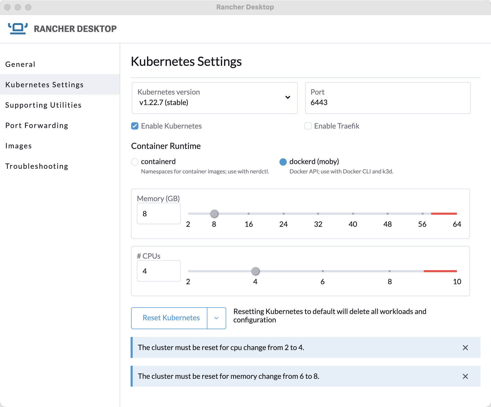

Download Rancher Desktop

https://rancherdesktop.io/

Uncheck Traefik

[No Traefik]

Add some Nginx

https://docs.rancherdesktop.io/how-to-guides/setup-NGINX-Ingress-Controller/

Rancher Desktop K3S updates

~/.kube/config

----
kubectx rancher-desktop
----

----
kubectl apply -f https://raw.githubusercontent.com/kubernetes/ingress-nginx/controller-v1.1.2/deploy/static/provider/cloud/deploy.yaml
----

----
kubectl get pods -n ingress-nginx
----

----
NAME                                       READY   STATUS      RESTARTS   AGE
svclb-ingress-nginx-controller-8b2lw       2/2     Running     0          32s
ingress-nginx-admission-create--1-5ljwf    0/1     Completed   0          32s
ingress-nginx-admission-patch--1-kc65b     0/1     Completed   1          32s
ingress-nginx-controller-cb87575f5-qzxc5   1/1     Running     0          32s
----

2 Deployments

----
kubectl create namespace mystuff
kubectl config set-context --current --namespace=mystuff

kubectl create deployment myappone --image=docker.io/burrsutter/hello
kubectl create deployment myapptwo --image=docker.io/burrsutter/hello

kubectl set env deployment myappone GREETING="One" 
kubectl set env deployment myapptwo GREETING="Two" 
----

Test env vars
----
kubectl exec -it $(kubectl get pods -l app=myappone -oname) -- curl localhost:8080
----

----
One from Quarkus! 1 on myappone-bbb449976-gpmqj
----

----
kubectl exec -it $(kubectl get pods -l app=myapptwo -oname) -- curl localhost:8080
----

----
Two from Quarkus! 1 on myapptwo-67c84b6544-pxjxv
----

2 Services

----
kubectl expose deployment myappone --port=8080 --type=ClusterIP
kubectl expose deployment myapptwo --port=8080 --type=ClusterIP
----

----
kubectl get services
NAME       TYPE        CLUSTER-IP      EXTERNAL-IP   PORT(S)    AGE
myappone   ClusterIP   10.43.152.75    <none>        8080/TCP   51s
myapptwo   ClusterIP   10.43.173.243   <none>        8080/TCP   51s
----

----
kubectl apply -f ingress-2.yaml
----

Port-forward a local port to 80 for nginx inside of k3s

----
kubectl port-forward --namespace=ingress-nginx service/ingress-nginx-controller 9090:80
----

----
kubectl get ingress
NAME                CLASS   HOSTS                             ADDRESS        PORTS   AGE
one-two-localhost   nginx   one.localdev.me,two.localdev.me   192.168.1.10   80      3m22s
----

----
curl one.localdev.me
One from Quarkus! 1 on myappone-bbb449976-t5fzj
----

----
curl two.localdev.me
Two from Quarkus! 2 on myapptwo-67c84b6544-kkd7v
----
